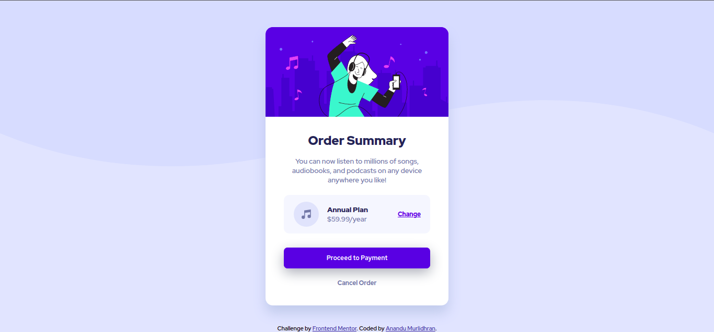

# Frontend Mentor - Order summary card solution

This is a solution to the [Order summary card challenge on Frontend Mentor](https://www.frontendmentor.io/challenges/order-summary-component-QlPmajDUj). Frontend Mentor challenges help you improve your coding skills by building realistic projects. 

## Table of contents

- [Overview](#overview)
  - [The challenge](#the-challenge)
  - [Screenshot](#screenshot)
  - [Links](#links)
- [My process](#my-process)
  - [Built with](#built-with)
  - [What I learned](#what-i-learned)
  - [Continued development](#continued-development)
- [Author](#author)

## Overview

### The challenge

Users should be able to:

- See hover states for interactive elements

### Screenshot


<br>The Desktop version


<br>The Mobile version


### Links

[Live Site URL](https://anandumurli.github.io/FrontendMentor_order-summary/)

## My process

Started with the skeleton html. Gave html a height of 100vh, then gave body a height of 100%. This way using 
```css
body{
    display: flex; 
    align-items: center;
    justify-content:center
}
``` 
helped put the whole thing in vertical center position.


### Built with

- Semantic HTML5 markup
- Flexbox


### What I learned

The background was two portion, one was the background image asset, and the color. Learned how one can easily make fancy designs by creating one svg file and then using background color. 


### Continued development

Want to start using custom variables in css.

## Author

- Frontend Mentor - [@anandumurli](https://www.frontendmentor.io/profile/anandumurli)
